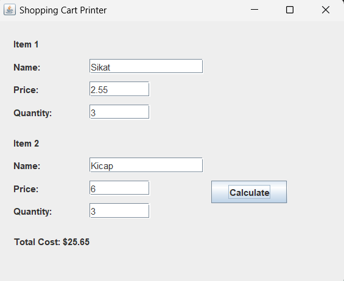

## Shopping Cart

### Project Description
This project is a simple Java App which allows user to input the name, price, and quantity of items. The program will then calculate the total price of the items.
### Usage
There are 2 implementations of this project:

1. GUI

To use the GUI Implementation of this project, make sure to cd into the GUI directory. Then, run the following commands:

`javac ShoppingCartPrinterGUI.java`

This line will create an executable .class file

`java ShoppingCartPrinterGUI.java`

This line will execute the .class file

Below is the example GUI that will appear.

2. Terminal

To run the Terminal version of the project, first make sure to cd into the Terminal directory.

Then, run the following commands:

`javac ItemToPurchase.java`

`javac ShoppingCartPrinter.java`

This line will create executable .class files

`java ShoppingCartPrinter ItemToPurchase`

This line will execute the .class files.

Below is the example Terminal implementation:

Item 1 
Enter the item name: 
Lampu 
Enter the item price: 
99.5 
Enter the item quantity: 
1  

Item 2 
Enter the item name: 
Troli 
Enter the item price: 
20 
Enter the item quantity: 
12

TOTAL COST

Lampu 1 @ $99.5 = $99.5

Troli 12 @ $20.0 = $240.0

Total: $339.5

### Customization
The current project initally sets only 2 items, but users can customize this within the code themselves.